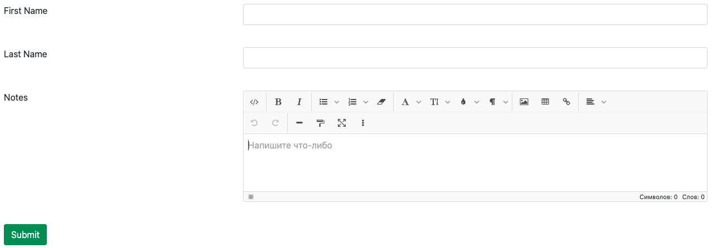

Vue 3 and Bootstrap 5 forms and cards generator

---

[](https://github.com/empla/reforms/actions/workflows/build.yml)


---


## Features

- Info cards
- Forms
- 15+ inputs types and output types
- Forms schemas
- Plugin system
- Internationalization
- Input & Output groups
- Form validation
- Server side validation
- Multiple and sortable fields

# Demo

You can [try it online](https://codesandbox.io/s/reforms-demo-jbpyv) 


## Installation

```sh
# Install before
npm i vue@next bootstrap@next

# Install reforms
npm i @empla/reforms
```

## Example

### Example with markup

```vue
<reforms-form>
  <reforms-input type="string" name="firstname" label="First Name" validation="required|string" />
  <reforms-input type="string" name="lastname" label="Last Name" validation="required|string" />
  <reforms-input type="html" name="notes" label="Notes" />
  <button type="submit" class="btn btn-success">
    Submit
  </button>
</reforms-form>
```

It creates form:



### Example with schema

You can create form with schema:

```js
const schema = {
    firstname: {
      type: 'string',
      attrs: {
        validation: 'required',
        label: 'First name'
      }
    },
    lastname: {
      type: 'string',
      attrs: {
        validation: 'required',
        label: 'Last name'
      }
    },
    notes: {
      type: 'html',
      attrs: {
        label: 'Notes',
      }
    }
};
```

And pass it to form:

```vue
<reforms-form :schema="schema">
  <button type="submit" class="btn btn-success">
    Submit
  </button>
</reforms-form>
```

## Documentation

todo

## License

[MIT](LICENSE)

---

Copyright &copy; 2021 EMPLA GROUP, LLC

Made with ❤️ 
by [Malik Zharykov](https://github.com/malikzh)️
